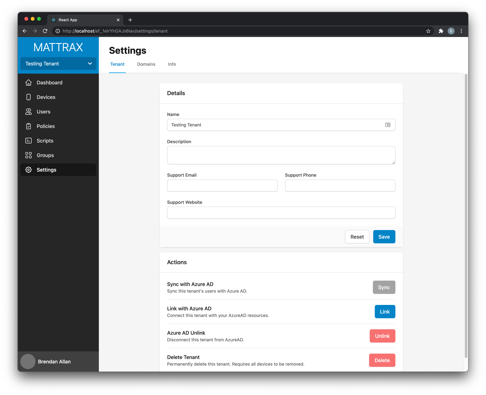

# Goal of Mattrax

The goal of Mattrax is to make a simple to use, yet highly advanced Mobile Device Management solution that allows a single policy to be enforced across all of your organisation's devices no matter the operating system.

## Development Progress

Mattrax has an in progress dashboard and MDM server. Support for Windows and Android management will be ready to be integrated when the dashboard has been built out more.

*Mattrax Dashboard Home Page*

*Mattrax Dashboard Settings Page*

 

Mattrax is built using [Go](https://golang.org), [Node](https://nodejs.org), [Typescript](https://www.typescriptlang.org), [GraphQL](https://graphql.org), [React](https://reactjs.org) and more!