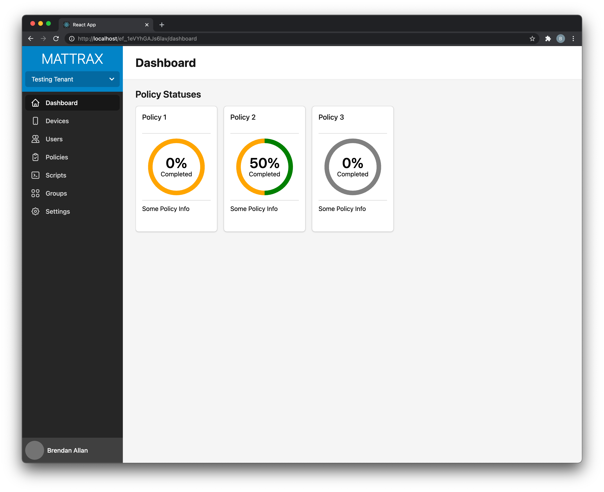

# Goal of Mattrax

The goal of Mattrax is to make a simple to use, yet advanced Mobile Device Management server that allows a single policy to be enforced across all of your organisation's devices no matter the operating system.

## Development Progress

Mattrax has a functional dashboard and MDM component although security is lacking and policies can't yet be scoped to a device or deployed via MDM.

*Mattrax Dashboard Home Page*

## Contributing
If you are interested in helping develop Mattrax yourself, join the Slack community. Mattrax is built using [Go](https://golang.org) and [Vue.js](https://vuejs.org).